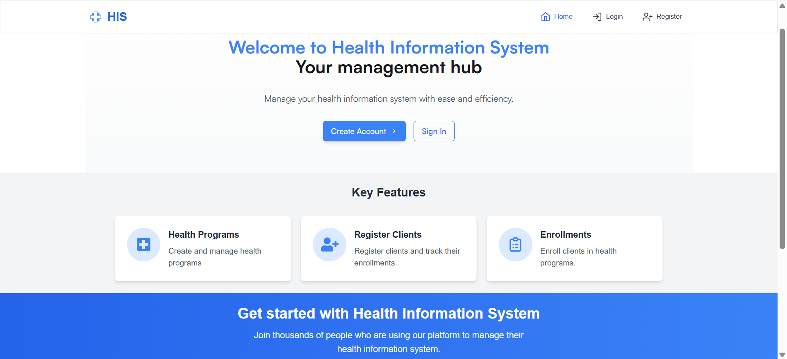
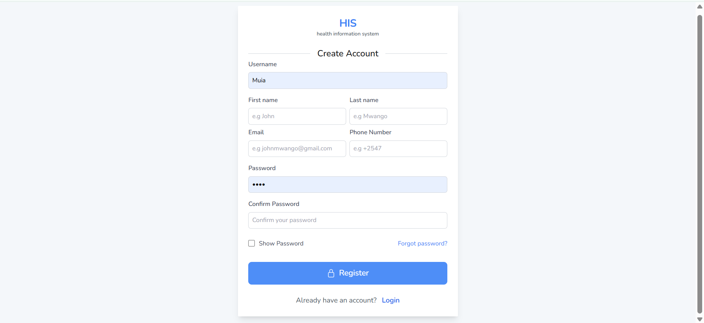
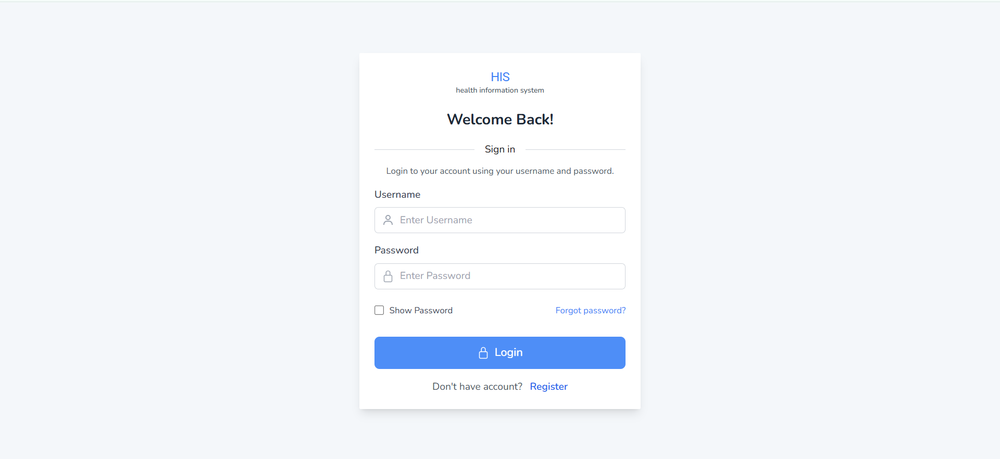
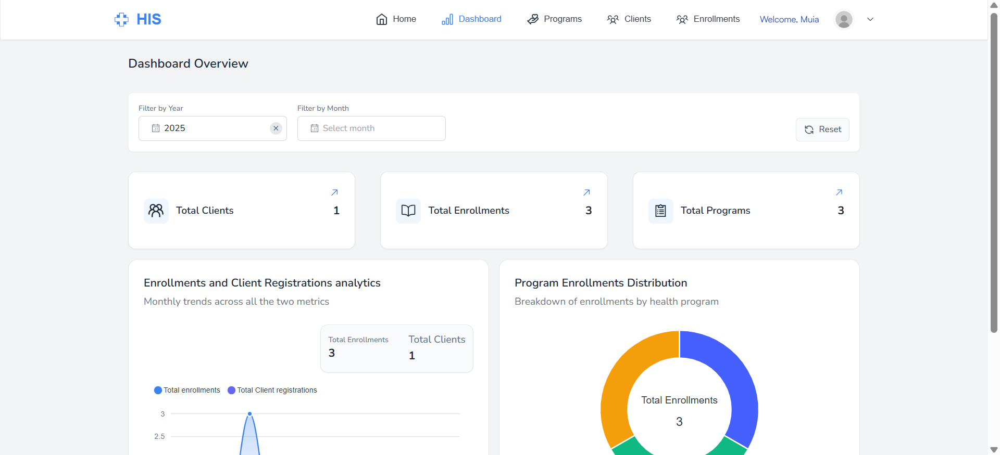
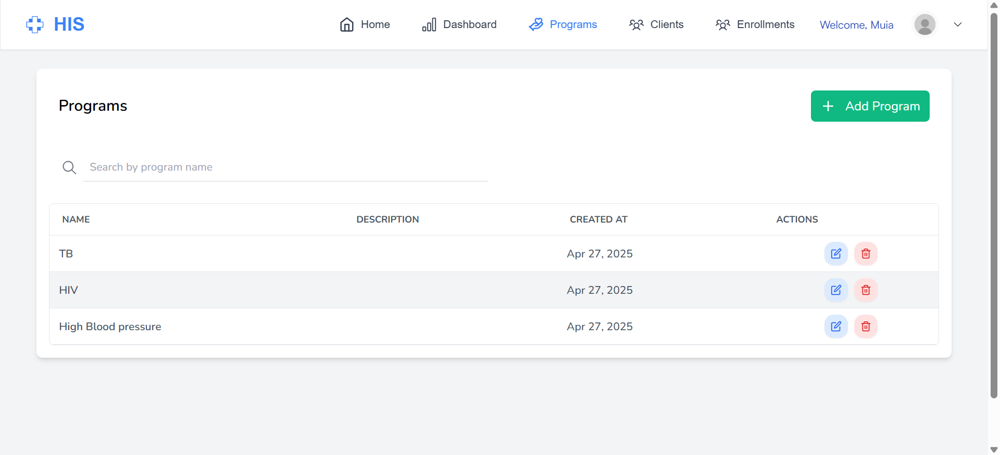
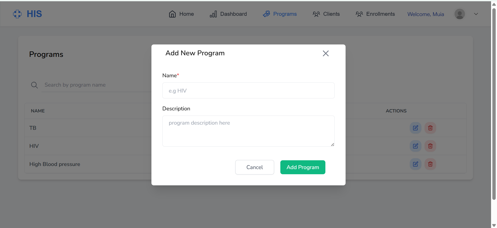

# Health Information System (HIS)

A comprehensive health information system for managing clients and health programs/services. This solution enables healthcare providers to efficiently manage client information, enroll clients in various health programs, and access client profiles through  RESTful APIs.

## Features

- User authentication and authorization with JWT
- Health program management
- Client registration and management
- Program enrollment for clients
- Client search functionality
- Client profile viewing with program enrollments
- RESTful API endpoints for integration with other systems
- API documentation with Swagger and ReDoc

## Tech Stack

### Backend
- Django 5.1.7
- Django REST Framework
- PostgreSQL (Production) / SQLite (Development)
- JWT Authentication (Simple JWT)
- Swagger/ReDoc for API documentation

### Frontend
- Next.js 15.3.1
- Tailwind CSS
- React Redux with Redux Toolkit

## Live Demo

- **Frontend**: [https://health-informantion-system.vercel.app/](https://health-informantion-system.vercel.app/)
- **Backend API Documentation**: [https://health-information-system-backend.onrender.com/api/swagger/](https://health-information-system-backend.onrender.com/api/swagger/)

## Screenshots







These screenshots provide a glimpse of the system's interface. For a complete experience and to appreciate all features

## Project Structure

The project follows a modular structure with the following apps:

- **users**: User management and authentication
- **clients**: Client registration and profile management
- **health_programs**: Health program creation and management
- **enrollments**: Client enrollment in health programs

## Getting Started

### Prerequisites

- Python 3.8+
- Node.js and npm
- Git
- PostgreSQL (for production)

### Installation

1. Clone the repository
   ```bash
   git clone https://github.com/mutungapeter/HIS.git
   cd HIS
   ```

### Backend Setup

1. Set up a virtual environment
   ```bash
   cd backend
   python -m venv venv
   source venv/bin/activate  # On Windows: venv\Scripts\activate
   ```

2. Install dependencies
   ```bash
   pip install -r requirements.txt
   ```

3. Environment Setup
   
   Create a `.env` file in the backend directory with the following variables:
   ```
   DEBUG=True
   CORS_ALLOWED_ORIGINS=http://localhost:3000
   ```

4. Database Setup
   ```bash
   python manage.py migrate
   ```

5. Run the development server
   ```bash
   python manage.py runserver
   ```

### Frontend Setup

1. Open a new terminal and navigate to the frontend directory
   ```bash
   cd frontend
   ```

2. Create a `.env` file with the following:
   ```
   NEXT_PUBLIC_SERVER_URI=http://localhost:8000/api
   ```

3. Install dependencies
   ```bash
   npm install
   ```

4. Build and start the frontend
   ```bash
   npm run build
   npm run start
   ```

5. Access the frontend at: http://localhost:3000

## Accessing the Application

1. Open your browser and navigate to http://localhost:3000
2. Create a new account using the registration form
3. Log in with your credentials
4. Start using the Health Information System features:
   - Create health programs
   - Register clients
   - Enroll clients in programs
   - Search for clients
   - View client profiles

## API Documentation

### Accessing APIS Swagger UI

1. Navigate to http://localhost:8000/api/swagger/ or the hosted version at https://health-information-system-backend.onrender.com/api/swagger/
2. For protected endpoints, you'll need to authenticate:
   - Log in through the listed login endpoint under users in the swagger or using the `/api/users/login/` endpoint
   - Copy the JWT token from the response
   - Click the "Authorize" button in the top-right corner of Swagger UI
   - Enter the token in the format: `Bearer <your_token>`
   - Click "Authorize" and close the dialog
   - You can now access protected endpoints

### ReDoc Documentation

For a more readable API documentation, visit http://localhost:8000/api/redoc/ or https://health-information-system-backend.onrender.com/api/redoc/

## API Endpoints

The system exposes the following API endpoints:

### Authentication
- `POST /api/users/register/`: Register a new user
- `POST /api/users/login/`: Login and obtain JWT tokens
- `POST /api/users/logout/`: Logout and blacklist JWT token

### Health Programs
- `GET /api/health-programs/`: List all health programs(with search functionality)
- `POST /api/health-programs/`: Create a new health program
- `GET /api/health-programs/<id>/`: Retrieve a specific health program
- `PUT /api/health-programs/<id>/`: Update a health program
- `DELETE /api/health-programs/<id>/`: Delete a health program

### Clients
- `GET /api/clients/`: List all clients (with search functionality)
- `POST /api/clients/`: Register a new client
- `GET /api/clients/<id>/`: Retrieve a client's profile
- `PUT /api/clients/<id>/`: Update a client's information
- `DELETE /api/clients/<id>/`: Delete a client

### Enrollments
- `GET /api/enrollments/`: List all enrollments
- `POST /api/enrollments/`: Enroll a client in one or multiple health programs
- `GET /api/enrollments/<id>/`: Retrieve a specific enrollment
- `DELETE /api/enrollments/<id>/`: Un-enroll a client from a program

## Authentication

The API uses JWT (JSON Web Token) authentication. To access protected endpoints, include the JWT token in the Authorization header:

```
Authorization: Bearer <your_jwt_token>
```

## Deployment

For deployment to production:

1. Set DEBUG=False in the backend .env file
2. Configure a proper DATABASE_URL pointing to your PostgreSQL instance
3. Set up proper CORS_ALLOWED_ORIGINS with your frontend domain
4. For the frontend, update the NEXT_PUBLIC_SERVER_URI to point to your deployed backend URL

## Security Considerations

- JWT token rotation is enabled
- Token blacklisting prevents reuse of tokens after logout
- CORS configuration to prevent unauthorized cross-origin requests
- Database connection pooling for production environments
- Environment variables for sensitive information
- Debug mode disabled in production


## License

MIT License

## Contact

Peter Mutunga - [mutungapetrah@gmail.com]

Github repo link: [https://github.com/mutungapeter/HIS.git](https://github.com/mutungapeter/HIS.git)

